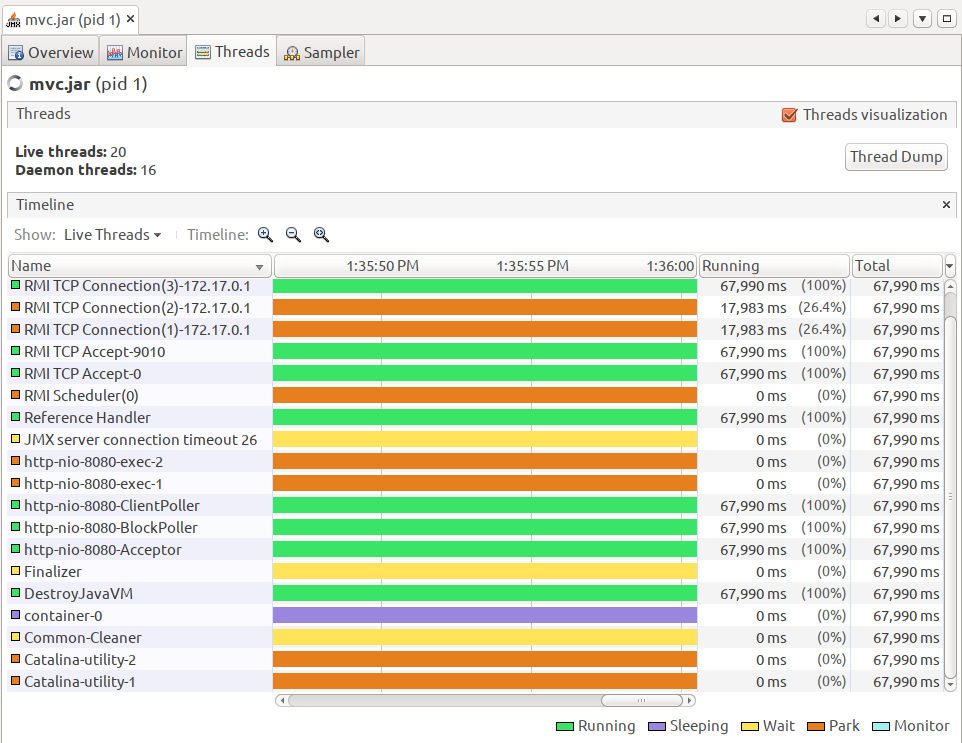
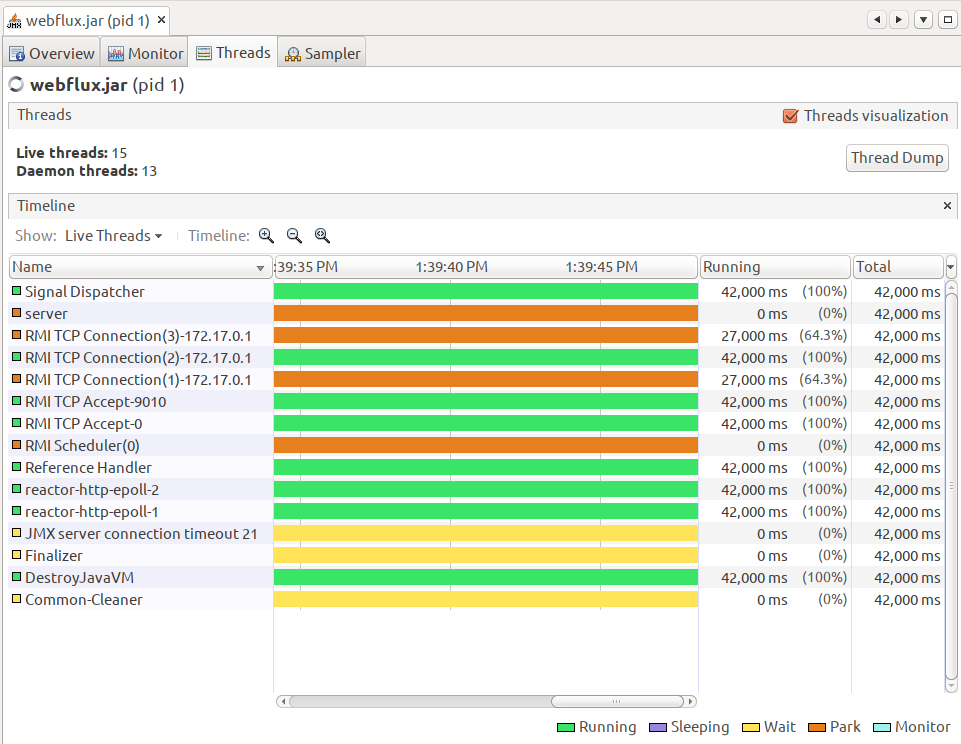

WebFlux 도입 논의 중 오픈뱅킹에서 어떻게 사용되었는지 설명이 있으면 좋겠다고 해서 정리를 해보았습니다. 

- WebFlux?
- Spring MVC?
- 스레드 라이브사이클?
- Back Pressure?
- 오픈뱅킹에서 WebFlux?
- Tomcat과 WebFlux 시나리오별 테스트
- 정리
- 참고

# WebFlux?

- 논블럭킹 서버(=Netty)와 Reactive Stream API(=Reactor) 조합입니다. 
- Servlet 3.1(from 2013년 ㄷㄷ)부터 논블럭킹 I/O를 제공하지만 Servlet API 규약에 Filter나 Servlet, getParameter등이 동기 또는 블럭킹이라서 새로운 API 규약?을 만들기로 했다고 합니다. 
- Reactor는 리엑티브 라이브러리 입니다. 2013년 말에 첫 릴리즈 후 현재 `Dysprosium-SR6` 인데 `reactor-core`는 3.3.4, `reactor-netty`는 0.9.6이 포함 되어 있네요. 3년전 쯤 모듈들을 분리하면서 `reactor-core`는 첫 릴리즈가 2.5로 `reactor-netty`는 0.5로 첫 릴리즈를 했나봅니다.

논블럭킹  + 리엑터이기 때문에 블럭킹 방식보다 처리량이 높습니다. 아래에서 이어 설명 하겠습니다.

# Spring MVC?

- 톰켓 + Servlet API 조합입니다.
- 더이상의 설명은 생략한다.

블럭킹 방식이기 때문에 요청별로 스레드를 사용하는 방식입니다. 스레드가 많으면 처리율은 높겠지만 너무 높게 설정하면 `Thread-Pool Hell` 이라는 상황을 만나게 됩니다. 음?

# 스레드 라이브사이클?

리엑티브하면 스레드별 처리율 이야기가 많이 나옵니다.

동기식 HTTP 호출 방식과 Reactive 방식간 스레드 사용에 대해서 그림을 하나 보시죠.


왼쪽은 스레드가 요청을 받고 전체 완료를 기다리고 있고, 오른쪽은 스레드가 요청 후 바로 종료 합니다. 오른쪽이 스레드 라이프 사이클이 짧죠. 그래서 리엑티브 방식이 스레드별 처리율이 좋다고 합니다. 

# Back Pressure?

리엑티브 관점에서 `Back Pressure`는 Subscriber가 Publisher에 Request 하는 것을 말합니다. 

음?? 

Subscriber가 request(N) 하면 Publisher가 N만큼 응답을 준다고 생각 할 수 있습니다.


소비하는 쪽이 소비 할 수 있을 만큼 전송량을 조절 한다는 의미인데요,

동기식 API를 사용하면 블로킹 작업에 의해 자연스럽게 `Back Pressure` 됩니다. (스레드가 고갈돼서 더이상 요청 안됨)
그리고 비동기식 API는 로직을 최대한 실행 시킬 수 있지만 느린 다른 시스템(=금결원?)에 영향을 줄 수 도 있겠네요.

# 오픈뱅킹에서 WebFlux?

오픈뱅킹 시스템은 `금결원` 연동이 주된 기능인 시스템입니다.

WebFlux(논블럭킹 + 리엑터)는 고정된 수의 스레드로 보다 적은 메모리를 사용하도록 조절 할 수 있는 능력을 가진 프레임워크 이기도 하고 
금결원 응답이 느릴 때 응답대기로 스레드가 고갈되는 현상을 피할 수 있어서 적절한 선택이 아닐까 합니다.

금결원이 힘들 때 같이 힘들어 하지 않아도 됩니다.

# Tomcat과 WebFlux 시나리오별 테스트

간단한 테스트를 해보았습니다. 

테스트를 위해 작업 스레드를 2개로 제한하고 동시에 100번 호출 합니다.
그리고 클라이언트는 5초마다 완료된 호출수를 출력하고 끝나면 전체 처리시간을 출력합니다.  

## Thread.sleep(300)

### Spring MVC

#### 설정
```bash
# application.properties
server.tomcat.max-threads=2
```

#### 실행코드
```java
public String blocking(@RequestParam("v") String v) throws InterruptedException {
    System.out.println(Thread.currentThread() + " > " + v);
    Thread.sleep(300);
    return v;
}
```

#### 서버 출력
```bash
...
Thread[http-nio-8080-exec-2,5,main] > 7
Thread[http-nio-8080-exec-1,5,main] > 55
Thread[http-nio-8080-exec-1,5,main] > 36
Thread[http-nio-8080-exec-2,5,main] > 1
...
```

#### 클라이언트 출력
```bash
./run-mvc.sh blocking
처리중: 100/100
처리중: 72/100
처리중: 40/100
처리중: 6/100
전체 처리시간: 20063ms
```

### WebFlux

#### 설정
```bash
# JVM 환경변수
-Dreactor.netty.ioWorkerCount=2
```

#### 실행코드
```java
public Mono<ServerResponse> blocking(ServerRequest request) {
    String v = request.queryParam("v").get();
    System.out.println(Thread.currentThread() + " < " + v);
    return Mono.fromCallable(() -> {
        Thread.sleep(300);
        System.out.println(Thread.currentThread() + " > " + v);
        return null;
    }).then(ok().bodyValue(v));
}
```

#### 서버 출력
```bash
...
Thread[reactor-http-epoll-1,5,main] < 48
Thread[reactor-http-epoll-2,5,main] < 47
Thread[reactor-http-epoll-1,5,main] > 48
Thread[reactor-http-epoll-2,5,main] > 47
...
```

#### 클라이언트 출력
```bash
./run-webflux.sh blocking
처리중: 100/100
처리중: 70/100
처리중: 36/100
처리중: 4/100
전체 처리시간: 20067ms
```

### Thread.sleep(300) 결과

Thread.sleep(300)은 현재 스레드를 소모하는 작업으로 JDBC 호출이나 다른 블럭킹 작업을 생각할 수 있습니다.
결과는 `Spring MVC`와 `WebFlux` 모두 스레드가 두개 사용되고 전체 수행시간도 약 `2000ms`로 동일한데요. 

이런 경우는 Worker 스레드 수에 따라 처리율이 영향을 받겠네요.

부가적으로, Reactor는 저런 작업을 위해 보통 별도 스레드풀을 할당하곤 합니다. -:)

```java
public Mono<ServerResponse> blockingThreaded(ServerRequest request) {
    return Mono.fromCallable(() -> {
       Thread.sleep(300);
       System.out.println(Thread.currentThread() + " > " + v);
       return null;
   })
    .onSubscribe(Schedulers.fromExecutor(Executors.newFixedThreadPool(64))) // 별도 스레드풀을 지정
    .then(..);
}
``` 

VisualVM에서 Live Threads를 확인 해보면 2개씩 떠 있는 것을 확인 할 수 있습니다.
- MVC

  
- WebFlux


## HTTP 호출 

위와 동일하게 작업 스레드 2개에 100번 호출입니다. delay 서버는 delay 파라메터 만큼 응답을 지연시켜 응답합니다.

### Spring MVC

#### 설정
```bash
# application.properties
server.tomcat.max-threads=2
```

#### 실행코드
```java
public String http(@RequestParam("v") String v) {
    System.out.println(Thread.currentThread() + " < " + v);
    restTemplate.exchange(
            "http://delay:8080/?delay=300&time=" + System.currentTimeMillis(),
            HttpMethod.GET,
            new HttpEntity<String>(new HttpHeaders()),
            String.class
    );
    System.out.println(Thread.currentThread() + " > " + v);
    return v;
}
```

#### 서버 출력
```bash
...
Thread[http-nio-8080-exec-1,5,main] > 32
Thread[http-nio-8080-exec-1,5,main] < 24
Thread[http-nio-8080-exec-2,5,main] < 48
Thread[http-nio-8080-exec-1,5,main] > 24
Thread[http-nio-8080-exec-2,5,main] > 48
... 
```

#### 클라이언트 출력
```bash
# 클라이언트 출력
./run-mvc.sh http
처리중: 100/100
처리중: 74/100
처리중: 42/100
처리중: 10/100
전체 처리시간: 20094ms
```

### WebFlux

#### 설정
```bash
JVM 환경변수
-Dreactor.netty.ioWorkerCount=2
```

#### 실행코드
```java
private Mono<ClientResponse> httpCall() {
    return webClient.get().uri("/?delay=300&time=" + System.currentTimeMillis()).exchange();
}

public Mono<ServerResponse> http(ServerRequest request) {
    String v = request.queryParam("v").get(); // 요청 순번
    System.out.println(Thread.currentThread() + " < " + v);
    return httpCall().flatMap(response -> {
        return response.bodyToMono(String.class).flatMap(s -> {
            System.out.println(Thread.currentThread() + " > " +
                    v +
                    " - " +
                    (System.currentTimeMillis() - Long.parseLong(s)) // 걸린시간
            );
            return ok().bodyValue(v);
        });
    });
}
```

#### 서버 출력
```bash
Thread[reactor-http-epoll-2,5,main] < 98
Thread[reactor-http-epoll-1,5,main] < 1
Thread[reactor-http-epoll-1,5,main] < 3
Thread[reactor-http-epoll-1,5,main] < 96
Thread[reactor-http-epoll-1,5,main] < 94

...

Thread[reactor-http-epoll-2,5,main] > 1 - 310
Thread[reactor-http-epoll-2,5,main] > 0 - 309
Thread[reactor-http-epoll-2,5,main] > 4 - 305
Thread[reactor-http-epoll-1,5,main] > 9 - 310
Thread[reactor-http-epoll-2,5,main] > 3 - 314
```

#### 클라이언트 출력
```bash
./run-webflux.sh http
처리중: 100/100
전체 처리시간: 5069ms
```

### HTTP 호출 결과

Spring MVC 호출은 `RestTemplate`이 Blocking이라 Thread.sleep(300)과 동일하지만 WebClient를 사용하는 WebFlux에서는 다릅니다. 
먼저 delay 서버로 100개를 다 던지고 응답이 오는 대로 처리 합니다. 출력결과를 보면 화살표 방향이 다릅니다. -:) 

전체 Spring MVC는 `20,000ms` WebFlux는 `5,000ms` 정도 걸렸네요.

## WebFlux 1 Thread + 1 HTTP 호출  

WebFlux의 작업 스레드수를 하나 줄여 보았습니다.

### WebFlux

#### 설정
```bash
# WebFlux JVM 환경변수
-Dreactor.netty.ioWorkerCount=1
```

#### 서버 출력
```bash
Thread[reactor-http-epoll-1,5,main] < 95
Thread[reactor-http-epoll-1,5,main] < 97
Thread[reactor-http-epoll-1,5,main] < 98
Thread[reactor-http-epoll-1,5,main] < 94

...

Thread[reactor-http-epoll-1,5,main] > 62 - 320
Thread[reactor-http-epoll-1,5,main] > 61 - 316
Thread[reactor-http-epoll-1,5,main] > 60 - 313
Thread[reactor-http-epoll-1,5,main] > 59 - 310
```

#### 클라이언트 출력
```bash
./run-webflux.sh http
처리중: 100/100
전체 처리시간: 5068ms
```

## WebFlux 1 Thread + 1 HTTP 호출 결과

WebFlux Thread 2개 때와 결과가 동일합니다.  

VisualVM에서 Live Threads를 보면 1개가 동작하고 있습니다.


## WebFlux 1 Thread + 2 HTTP 호출 

HTTP 호출을 하나 더 늘려보았습니다.

### WebFlux

#### 설정
```bash
# WebFlux JVM 환경변수
-Dreactor.netty.ioWorkerCount=1
```

#### 실행코드
```java
public Mono<ServerResponse> multi(ServerRequest request) {
    String v = request.queryParam("v").get();
    System.out.println(Thread.currentThread() + " - " + v);
    return Mono.zip(httpCall(), httpCall())
            .flatMap(pair -> {
                return pair.getT1().bodyToMono(String.class)
                        .zipWith(pair.getT2().bodyToMono(String.class))
                        .map(echoTimes -> {
                            return (Long.parseLong(echoTimes.getT1()) + Long.parseLong(echoTimes.getT2())) / 2;
                        });
            })
            .flatMap(echoTime -> {
                System.out.println(Thread.currentThread() +
                        " = " +
                        v +
                        " - " +
                        (System.currentTimeMillis() - echoTime) // 걸린시간
                );
                return ServerResponse.ok().bodyValue(v);
            });
}
```

#### 서버 출력
```bash
Thread[reactor-http-epoll-1,5,main] - 0
Thread[reactor-http-epoll-1,5,main] - 98
Thread[reactor-http-epoll-1,5,main] - 62
Thread[reactor-http-epoll-1,5,main] - 63

...

Thread[reactor-http-epoll-1,5,main] = 68 - 303
Thread[reactor-http-epoll-1,5,main] = 58 - 304
Thread[reactor-http-epoll-1,5,main] = 99 - 304
Thread[reactor-http-epoll-1,5,main] = 61 - 309
```

#### 클라이언트 출력
```bash
 ./run-webflux.sh multi
처리중: 100/100
전체 처리시간: 5217ms
```

## WebFlux 1 Thread + 2 HTTP 호출 결과

WebFlux Thread 2개 때보다 200ms정도 처리 시간이 늘었습니다.

결과를 표로 정리해 보면 아래와 같습니다.


# 정리

오픈뱅킹 실제 코드는 채널 BT Rest API 호출 + DB 호출 + 금결원 Rest API 호출이 테스트 시나리오 보다 복잡하게 구현 돼서 운영을 대비한 적절한 설정 값이 필요하지만 트래픽이 폭발하거나 금결원 응답이 밀릴 때 효과적으로 서비스가 운영될 것으로 예상(기원..) 해봅니다.

# 참고

그리고 넷플릭스에서 RxNetty vs Tomcat Benchmark 한 자료가 보여서 참고로 링크 달아둡니다.

https://www.slideshare.net/brendangregg/rxnetty-vs-tomcat-performance-results

   
