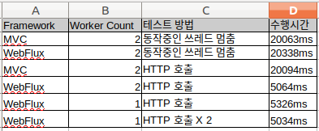

**톰켓과 웹플럭스 아키텍쳐 설명은 웹에 많이 있는 내용이고 어플리케이션 사용 관점에서 "X에서의 WebFlux"를 설명하겠습니다.**

## WebFlux?

### Netty + Reactor 기반
=> 논블럭킹 + 비동기 프로그래밍
=> 처리 결과를 기다리는 동안 다른 작업이 가능하다
=> 스레드 개수보다 많은 처리를 할 수 있다

## Spring MVC?

### Tomcat 기반
=> 블럭킹 + 동기 프로그래밍 
=> 처리 결과를 받을 때 까지 대기한다
=> 지정된 스레드 개수만큼 처리를 할 수 있다

아래 그림으로 설명 될 수 있습니다. 


Reactive 버전이 스레드 사용이 적습니다. 응답을 요청하고 바로 응답을 받기 때문에 스레드가 기다리지 않기 때문이죠.

X에서 WebFlux?

WebFlux(Non-Blocking + Reactor)는 적고 고정된 수의 쓰레드로 보다 적은 메모리를 사용하도록 조정할 수 있는 능력이 있고,
Reactor는 여러 여러 데이터 소스에서 가져온 데이터를 조합이 편리하기 때문에 외부 연동이 주된 역활인 X에 적합하다고 할 수 있습니다.

# 그럼, 적고 고정된 수의 쓰레드로 보다 적은 메모리를 사용하도록 조정할 수 있는 능력이란?

## Blocking vs Non-Blocking 관점에서 보도록 하겠습니다.

### Blocking 

테스트를 위해 Worker `스레드를 2개`로 제한하고 `100`번의 호출을 해보면,

#### Spring MVC
```
# application.properties
server.tomcat.max-threads=2
```

```java
public String blocking(@RequestParam("v") String v) throws InterruptedException {
    System.out.println(Thread.currentThread() + " > " + v);
    Thread.sleep(300);
    return v;
}
```

```bash
# 톰켓 서버 출력
...
Thread[http-nio-8080-exec-2,5,main] > 7
Thread[http-nio-8080-exec-1,5,main] > 55
Thread[http-nio-8080-exec-1,5,main] > 36
Thread[http-nio-8080-exec-2,5,main] > 1
...
```

```bash
# 클라이언트 출력
./run-mvc.sh blocking
처리중: 100/100
처리중: 72/100
처리중: 40/100
처리중: 6/100
전체 처리시간: 20063ms
```

#### WebFlux
```bash
# JVM 환경변수
-Dreactor.netty.ioWorkerCount=2
```

```java
public Mono<ServerResponse> blocking(ServerRequest request) {
    String v = request.queryParam("v").get();
    System.out.println(Thread.currentThread() + " < " + v);
    return Mono.fromCallable(() -> {
        Thread.sleep(300);
        System.out.println(Thread.currentThread() + " > " + v);
        return null;
    }).then(ok().bodyValue(v));
}
```

```bash
# WebFlux 서버 출력
...
Thread[reactor-http-epoll-1,5,main] < 46
Thread[reactor-http-epoll-2,5,main] > 45
Thread[reactor-http-epoll-1,5,main] > 46
Thread[reactor-http-epoll-1,5,main] < 48
Thread[reactor-http-epoll-2,5,main] < 47
Thread[reactor-http-epoll-1,5,main] > 48
Thread[reactor-http-epoll-2,5,main] > 47
...
```

```bash
# 클라이언트 출력
./run-webflux.sh blocking
처리중: 100/100
처리중: 72/100
처리중: 40/100
처리중: 6/100
전체 처리시간: 20338ms
```

## Tomcat, WebFlux 모두 `스레드 2개`가 사용되고 `처리 시간 거의 동일`.
## => Blocking 구간은 Tomcat, Webflux간 차이가 없다.

----

### Non-Blocking

동일하게 테스트를 위해 Worker `스레드를 2개`로 제한하고 `100`번의 호출을 해보면,

#### Spring MVC

```bash
# application.properties
server.tomcat.max-threads=2
```

```java
public String http(@RequestParam("v") String v) {
    System.out.println(Thread.currentThread() + " < " + v);
    restTemplate.exchange(
            "http://delay:8080/?delay=300&time=" + System.currentTimeMillis(),
            HttpMethod.GET,
            new HttpEntity<String>(new HttpHeaders()),
            String.class
    );
    System.out.println(Thread.currentThread() + " > " + v);
    return v;
}
```

```bash
# 서버출력
...
Thread[http-nio-8080-exec-1,5,main] < 32
Thread[http-nio-8080-exec-2,5,main] > 53
Thread[http-nio-8080-exec-1,5,main] > 32
Thread[http-nio-8080-exec-1,5,main] < 24
Thread[http-nio-8080-exec-2,5,main] < 48
Thread[http-nio-8080-exec-1,5,main] > 24
Thread[http-nio-8080-exec-2,5,main] > 48
... 
```

```bash
# 클라이언트 출력
./run-mvc.sh http
처리중: 100/100
처리중: 74/100
처리중: 42/100
처리중: 10/100
전체 처리시간: 20094ms
```

#### WebFlux

```bash
JVM 환경변수
-Dreactor.netty.ioWorkerCount=2
```

```java
private Mono<ClientResponse> httpCall() {
    return webClient.get().uri("/?delay=300&time=" + System.currentTimeMillis()).exchange();
}

public Mono<ServerResponse> http(ServerRequest request) {
    String v = request.queryParam("v").get();
    System.out.println(Thread.currentThread() + " < " + v);
    return httpCall().flatMap(response -> {
        return response.bodyToMono(String.class).flatMap(s -> {
            System.out.println(Thread.currentThread() + " > " +
                    v +
                    " - " +
                    (System.currentTimeMillis() - Long.parseLong(s)) // 걸린시간
            );
            return ok().bodyValue(v);
        });
    });
}
}
```

```bash
# 서버 출력 
...
Thread[reactor-http-epoll-1,5,main] > 18 - 647
Thread[reactor-http-epoll-1,5,main] > 30 - 646
Thread[reactor-http-epoll-1,5,main] > 99 - 644
Thread[reactor-http-epoll-2,5,main] > 31 - 753
Thread[reactor-http-epoll-2,5,main] > 38 - 777
Thread[reactor-http-epoll-2,5,main] > 66 - 739
Thread[reactor-http-epoll-2,5,main] > 29 - 754
Thread[reactor-http-epoll-2,5,main] > 34 - 778
...

```

```bash
# 클라이언트 출력 
./run-webflux.sh http
처리중: 100/100
전체 처리시간: 5064ms
```

## WebFlux 모두 2개의 쓰레드가 사용되고 처리 시간은 WebFlux가 4배정도 빠르다.
---

#### WebFlux Worker 스레드수를 줄여보자

```bash
# WebFlux JVM 환경변수
-Dreactor.netty.ioWorkerCount=1
```

```bash
# 서버 출력
...
Thread[reactor-http-epoll-1,5,main] > 88 - 766
Thread[reactor-http-epoll-1,5,main] > 74 - 765
Thread[reactor-http-epoll-1,5,main] > 98 - 762
Thread[reactor-http-epoll-1,5,main] > 77 - 765
Thread[reactor-http-epoll-1,5,main] > 78 - 759
Thread[reactor-http-epoll-1,5,main] > 96 - 758
Thread[reactor-http-epoll-1,5,main] > 90 - 757
Thread[reactor-http-epoll-1,5,main] > 64 - 756
...
```

```bash
./run-webflux.sh http
처리중: 100/100
전체 처리시간: 5326ms
```

## WebFlux는 1개의 스레드를 사용하고 처리시간은 WebFlux 2개 스레드 사용과 거의 동일하다.

---

#### Http 호출수를 늘려보자

```bash
# WebFlux JVM 환경변수
-Dreactor.netty.ioWorkerCount=1
```

```java
private Mono<ClientResponse> httpCall() {
    return webClient.get().uri("/?delay=300&time=" + System.currentTimeMillis()).exchange();
}

public Mono<ServerResponse> multi(ServerRequest request) {
    String v = request.queryParam("v").get();
    System.out.println(Thread.currentThread() + " - " + v);
    return Mono.zip(httpCall(), httpCall())
            .flatMap(pair -> {
                return pair.getT1().bodyToMono(String.class)
                        .zipWith(pair.getT2().bodyToMono(String.class))
                        .map(echoTimes -> {
                            return (Long.parseLong(echoTimes.getT1()) + Long.parseLong(echoTimes.getT2())) / 2;
                        });
            })
            .flatMap(echoTime -> {
                System.out.println(Thread.currentThread() +
                        " = " +
                        v +
                        " - " +
                        (System.currentTimeMillis() - echoTime) // 걸린시간
                );
                return ServerResponse.ok().bodyValue(v);
            });
}
```
```bash
# 서버 출력
...
Thread[reactor-http-epoll-1,5,main] = 8 - 819
Thread[reactor-http-epoll-1,5,main] = 7 - 828
Thread[reactor-http-epoll-1,5,main] = 6 - 836
Thread[reactor-http-epoll-1,5,main] = 0 - 837
Thread[reactor-http-epoll-1,5,main] = 98 - 834
Thread[reactor-http-epoll-1,5,main] = 2 - 831
Thread[reactor-http-epoll-1,5,main] = 44 - 829
...
```   

```bash
# 클라이언트 출력
./run-webflux.sh multi
처리중: 100/100
전체 처리시간: 5034ms
```

## Http 호출이 하나 더 늘었지만 WebFlux는 1개의 쓰레드를 사용하고 처리시간은 WebFlux 2개 스레드 사용과 거의 동일하다.

----

표로 정리해 보자
(http는 300ms 지연후 응답을 받게 되어있다) 



```java
# 클라이언트 코드

public static void main(String[] args) throws InterruptedException {
    String url = args[0];

    RestTemplate restTemplate = new RestTemplate();

    final int nThreads = 100;

    ExecutorService executorService = Executors.newFixedThreadPool(nThreads);

    CyclicBarrier cyclicBarrier = new CyclicBarrier(nThreads);
    CountDownLatch countDownLatch = new CountDownLatch(nThreads);

    long time = System.currentTimeMillis();

    for (int i = 0; i < nThreads; i++) {
        int index = i;

        executorService.submit(() -> {
            // 동접의 의미로 100개 요청을 한번에 보낸다. 
            // 요청 쓰레드가 100개 되기 전까지 아래 라인은 실행되지 않는다
            cyclicBarrier.await();  
            try {
                ResponseEntity<String> response = restTemplate.exchange(
                        "http://" + url + "?v=" + index,
                        HttpMethod.GET,
                        new HttpEntity<String>(new HttpHeaders()),
                        String.class
                );
                if (!response.getStatusCode().is2xxSuccessful()) {
                    System.out.println("error");
                }
            } finally {
                countDownLatch.countDown();
            }
            return null;
        });
    }

    while (true) {
        if (countDownLatch.getCount() == 0) {
            System.out.println("전체 처리시간: " + (System.currentTimeMillis() - time) + "ms");
            executorService.shutdown();
            executorService.awaitTermination(1, TimeUnit.NANOSECONDS);
            break;
        }
        System.out.println("처리중: " + (countDownLatch.getCount() + "/" + nThreads));
        Thread.sleep(5000);
    }
}
```

**부가적으로 Reactive한 방식은 스트림마다 스레드 지정이 수월해서 스트림별로 처리율을 달리 할 필요가 있다면 수월하게 적용 할 수 있다.**

가령, /a, /b 2개의 엔드포인트가 있다면,

```java
// 지정한 ThreadPool에서 동작
Mono<String> endpointA() {
    return call1().zipWith(call2())
        .publishOn(Schedulers.fromExecutor(Executors.newFixedThreadPool(512)))
        .flatMap(pair -> ... );
}

// 기본 Worker ThreadPool 에서 동작
Mono<String> endpointB() {
    return call1().zipWith(call2()).flatMap(pair -> ...);
}
```

X에서 사용사례

...

## 기타
    
- Spring MVC에 AsyncRestTemplate은 Depreacte 되었고 WebFlux에 포함된 WebClient를 권하고 있다.
    => https://docs.spring.io/spring/docs/current/javadoc-api/org/springframework/web/client/AsyncRestTemplate.html

- JDBC 구간은 블럭킹이라 무용하다
    => 별도 스레드풀에서 실행을 한다면 유용하다. 
    => 별도 스레드풀을 사용 않으면 MVC와 동일하게 기본 스레드풀에서 실행된다.

- MVC에서도 DB 구간을 별도 스레드에서 실행 할수 있을텐데?
    => 가능하지만 리엑터가 여러 데이터 조합에는 탁월하다
    
## 참고
    - 넷플릭스에서 비교한RxNetty vs Tomcat Benchmark (WebFlux는 아님) 
    https://www.slideshare.net/brendangregg/rxnetty-vs-tomcat-performance-results


